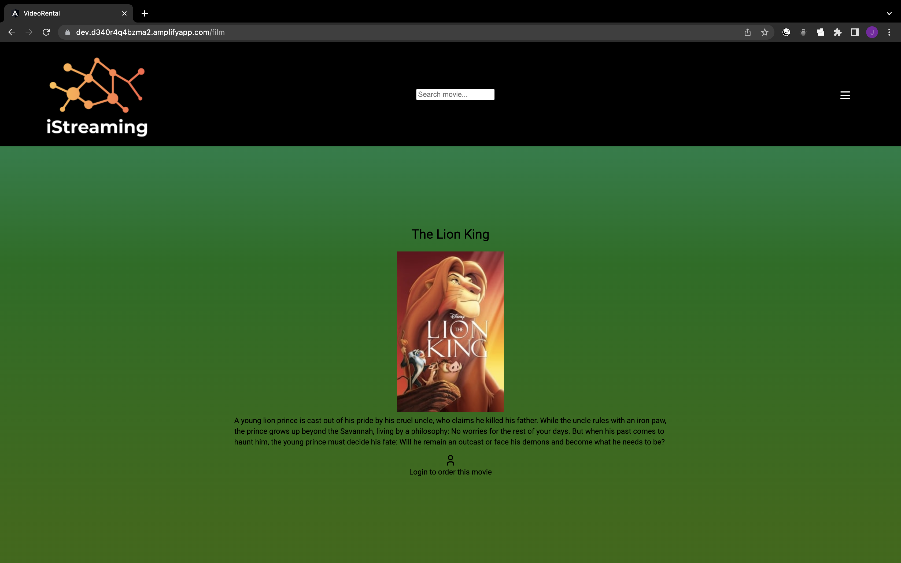
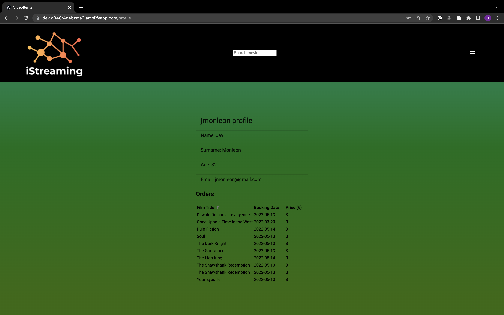

# FSD Video Rental Store Frontend (With Angular)
This is my eighth project of GeeksHubs Academy FSD bootcamp.

The objective is to get in touch with Angular Framework. So I decided to re-made the same project I made <a href='https://github.com/jmonloop/GeekshubsFSD_Pr05_VideoStoreFrontend'>here</a> but using the Google's technology.

Some functionalities has not been included because I considered them redundant and the project has been mady only for educational purposes. 
Anyway, I used most of the main features of a typical frontend.

<a href='https://github.com/jmonloop/GeekshubsFSD_Pr04_VideoStoreBackend'>The backend</a> is the same of the last project.

<a href='https://dev.d340r4q4bzma2.amplifyapp.com'>Here</a> you can go to the app.

[Features](#features)

* [Home](#home)

* [Paginator](#paginator)

* [Movie detail](#movie-detail)

* [User Authentication](#user-authentication)

* [User Profile](#user-profile)

* [List sorting](#list-sorting)

[Thanks](#thanks)

## Structure

### Home
Main view is home, where the app shows a rooster with top rated movies from The Movie Database.

 

User can go to watch movie details by clicking it or either searching it in the top search input bar. The searching bar automatically triggers a TMDB endpoint that searchs by title, so results are shown as the user types. A kind of **Debounce functionality** has been added for not to overcharge backend calls.

 

This bar is accessible from the entire application.

### Paginator

The total amount of results is divided by pages. There is a **pagination component** at the bottom. All data is retrieved dinamically from TMDB when the user changes page.

 

### Movie Detail

In this view the **specific details of the movie are mapped** into different tabs.

 

At the bottom, a message is shown that user must be logged in for ordering the movie.

And up to here, the views limited to guest user. Now let's see the authentication system.

### User authentication
At the right-top, in the header, there is a burger button which shows a modal with user data. Different links are shown depending if the user is logged or not.

When user signs in succesfully, the application saves the credentials and now he can access to the client views.

When user is logged, the movie-detail view shows at the bottom the place order option.

 

A different option is shown depending on the credentials and order status.

### User Profile

User can consult his profile data and the orders he actually owns in the database.
Profile view can be accessed by clicking on the username, at the user data burger button.

 

### List Sorting

User orders can be sorted alphabetically (by title) or numecrically (by date or by price)

 

## Thanks

* Thanks to <a href='https://github.com/Dave86dev'>David Ochando</a>, <a href='https://github.com/AdrianaFayos'>Adriana Fayos</a> and <a href='https://github.com/ManuelSLemos'>Manuel S.Lemos</a> for the training received.

* Thanks to everyone who spends time spreading their knowledge in Stack Overflow.

* Created by Javier Monleón López (https://github.com/jmonloop)

[Go to Top](#structure)
